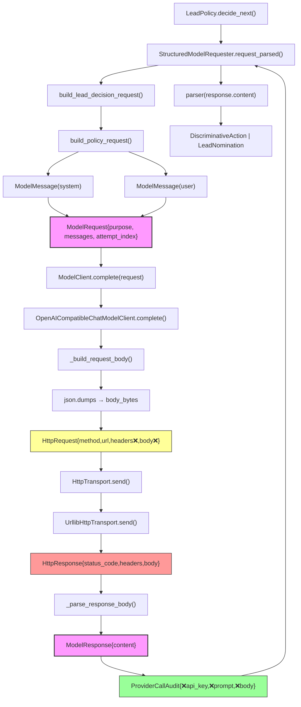

# CHT-5.2B-1 — LLM-to-Provider Dataflow and Redaction Boundary Audit

## 1. Scope and Accepted Parent Commit

- **Purpose**: Map every runtime object and code path from prompt construction
  through the ModelClient protocol, Provider HTTP serialization, response
  parsing, and audit-record creation.  Determine per-category allow/deny
  rules, classify deferred issues D1 and D2 from CHT-5.2A, and propose the
  smallest safe repair decomposition.
- **Parent commit**: `a02d86b`
- **Parent branch**: `recovery/cht52a-llm-policy-boundary`
- **Audit branch**: `audit/cht52b1-llm-provider-boundary`
- **Date**: 2026-06-13
- **Constraint**: Zero production-code modifications in this phase.

## 2. Current Call Graph

### 2.1 Symbol-Level Trace for One Successful Model Request

The following trace follows a `StructuredLLMLeadPolicy.decide_next()` call
from prompt construction through transport and back to parsed result.

```
1.  StructuredLLMLeadPolicy.decide_next(snapshot=...)
    │   File: prism_cht/llm_policy.py:148
    │
    ▼
2.  StructuredModelRequester.request_parsed(...)
    │   File: prism_cht/llm_policy.py:78
    │   Calls: request_builder → parser → retry loop
    │
    ▼
3.  build_lead_decision_request(snapshot=..., graph=..., allowed_tool_names=...,
                                 attempt_index=0, repair_error=None)
    │   File: prism_cht/llm_prompts.py:311
    │   Calls: build_evidence_catalog → build_policy_request
    │
    ▼
4.  build_policy_request(purpose=..., context=..., response_schema=...,
                          attempt_index=0)
    │   File: prism_cht/llm_prompts.py:144
    │   Constructs:
    │     ModelMessage(role="system", content=<instructions + schema>)
    │     ModelMessage(role="user",   content=<canonicalized context JSON>)
    │     → ModelRequest(purpose=..., messages=(sys, user), attempt_index=0)
    │   File: prism_cht/llm_types.py:31-48
    │
    ▼
5.  StructuredModelRequester.request_parsed → self._client.complete(request=...)
    │   File: prism_cht/llm_policy.py:105
    │   ┌─<<< ModelClient protocol boundary >>>─┐
    │
    ▼
6.  OpenAICompatibleChatModelClient.complete(request=ModelRequest)
    │   File: prism_cht/openai_compatible_client.py:76
    │
    ├─► _build_request_body(request)
    │   File: prism_cht/openai_compatible_client.py:175
    │   Returns dict:
    │     { "model":..., "messages": [{role,content},...],
    │       "stream":false, "max_tokens":..., "response_format":... }
    │
    ├─► json.dumps(body_dict, sort_keys=True) → body_bytes
    │   File: prism_cht/openai_compatible_client.py:98-100
    │
    ├─► HttpRequest(method="POST", url=..., headers={}, body=body_bytes,
    │               timeout_seconds=...)
    │   File: prism_cht/http_transport.py:22-55
    │   Headers include: "Authorization": f"Bearer {api_key}"
    │   File: prism_cht/openai_compatible_client.py:104-108
    │   API key source: OpenAICompatibleChatConfig.api_key
    │                   (field(repr=False))
    │   File: prism_cht/provider_config.py:65-262
    │
    ├─► self._transport.send(request=HttpRequest, max_response_bytes=...)
    │   File: prism_cht/openai_compatible_client.py:118
    │   ┌─<<< HttpTransport protocol boundary >>>─┐
    │   │
    │   ├─ (real path) UrllibHttpTransport.send(...)
    │   │   File: prism_cht/http_transport.py:124
    │   │   urllib.request.Request → urlopen → HttpResponse
    │   │   Error conversion: URLError → ProviderTransportError
    │   │                     HTTPError → HttpResponse (error status)
    │   │
    │   ▼
    ├─► HttpResponse(status_code=200, headers={}, body=<bytes>)
    │   File: prism_cht/http_transport.py:63-90
    │
    ├─► _parse_response_body(http_response.body)
    │   File: prism_cht/openai_compatible_client.py:203
    │   json.loads(body) → validate choices[0].message.content
    │   Returns: (finish_reason, ProviderUsage, content_str)
    │
    ├─► ModelResponse(content=content_str)
    │   File: prism_cht/llm_types.py:51-59
    │
    ├─► [finally] ProviderCallAudit(purpose=..., attempt_index=...,
    │        model=..., endpoint=..., status_code=..., elapsed_ms=...,
    │        request_bytes=..., response_bytes=..., finish_reason=...,
    │        usage=ProviderUsage(...), outcome="success")
    │   File: prism_cht/openai_compatible_client.py:153-169
    │   File: prism_cht/provider_types.py:98-146
    │   Appended to self._audit
    │
    ▼
7.  Back in StructuredModelRequester.request_parsed:
    parser(response.content)
    │   Calls: parse_lead_policy_decision(text)
    │   File: prism_cht/llm_json.py:324
    │   Returns: DiscriminativeAction | LeadNomination
    │
    ▼
8.  StructuredLLMLeadPolicy.decide_next returns PolicyDecision
```

### 2.2 Exception Paths

| Error site | Exception type | S1-S4 in exception? | Audit written? |
|---|---|---|---|
| `UrllibHttpTransport.send` — `URLError` | `ProviderTransportError` | No | Yes (outcome=`transport_error`) |
| `UrllibHttpTransport.send` — `HTTPError` | `ProviderHTTPError` (via 2xx check) | No (message is `"HTTP {code}..."`) | Yes (outcome=`http_error`) |
| `_parse_response_body` — JSON/bad shape | `ProviderResponseError` | No (structural message only) | Yes (outcome=`response_error`) |
| `parse_lead_policy_decision` — bad JSON | `StructuredOutputError` | No (structural message) | Yes (via caller's audit if at provider level) |
| `ProviderConfigurationError` — bad config | `ProviderConfigurationError` | No (`api_key` never in message) | N/A (before any call) |
| `PromptBudgetExceededError` | `PromptBudgetExceededError` | No (char count only) | N/A (before any call) |

### 2.3 Mermaid Flowchart



Legend:
- Pink boxes (`ModelRequest`, `ModelResponse`): carry S2/S4; default `repr()` exposes content (D1 gap)
- Yellow box (`HttpRequest`): carries S1/S2 but already has `repr=False` on sensitive fields
- Red box (`HttpResponse`): carries S3/S4; default `repr()` exposes body and headers (gap)
- Green box (`ProviderCallAudit`): deliberately excludes S1-S4; no repr issue
- ❌ marker indicates field excluded from `repr()` (`field(repr=False)`)

## 3. Sensitive-Data Classification

### 3.1 Categories

| Category | Description | Examples |
|---|---|---|
| S1 | Credential secrets | API key, `Authorization: Bearer ...` header |
| S2 | Raw prompt content | System message, user message, evidence text |
| S3 | Raw Provider response body | HTTP body bytes before JSON parsing |
| S4 | Parsed model payload | `choices[0].message.content` string |
| S5 | Operational metadata | Status code, latency, token counts, model name |
| S6 | Ground-truth-only evaluation data | Labels, expected answer, scoring fields |

### 3.2 Per-Destination Allow/Deny Matrix

| Destination | S1 | S2 | S3 | S4 | S5 | S6 |
|---|---|---|---|---|---|---|
| In-memory semantic objects | COND | ALLOW | COND | ALLOW | ALLOW | DENY |
| HTTP transport request | ALLOW | ALLOW | N/A | N/A | ALLOW | DENY |
| HTTP transport response | DENY | N/A | ALLOW | COND | ALLOW | DENY |
| Provider audit records | DENY | DENY | DENY | DENY | ALLOW | DENY |
| Exception text | DENY | DENY | DENY | COND | ALLOW | DENY |
| `repr()` / debug output | DENY | **DENY** | **DENY** | **DENY** | ALLOW | DENY |
| Prompt serialization | DENY | ALLOW | N/A | N/A | N/A | DENY |
| Persisted logs | DENY | DENY | DENY | DENY | ALLOW | DENY |
| Fake-client local recording | N/A | ALLOW | N/A | ALLOW | N/A | N/A |

**S1 CONDITION** (in-memory): Allowed only in `OpenAICompatibleChatConfig.api_key` (repr=False) and in `HttpRequest.headers` (repr=False). Never in `ProviderCallAudit`.
**S3 CONDITION** (in-memory): Allowed in `HttpResponse.body` for parsing only; should be discarded after content extraction.
**S4 CONDITION** (HTTP response): Embedded in raw body; extracted during parsing.
**S4 CONDITION** (exception text): Parser error messages include structural info (missing field names) but NOT the full raw response body.
**S2/S3/S4 in repr() (bold)**: These should be DENY but are currently ALLOW in several dataclasses — this is the D1 issue. `HttpResponse` also exposes S3/S4 in repr — a related gap.

## 4. Runtime-Object Inventory

### 4.1 Inventory Table

| Object | Module | Fields | Carries S1-6? | Default repr exposes? | In audit? | In exception? | Risk | Treatment |
|---|---|---|---|---|---|---|---|---|
| `ModelMessage` | `llm_types.py` | `role`, `content` | S2 (content) | YES — all fields | No | No | Latent — if logged, raw prompt leaks | Add `repr=False` on `content` |
| `ModelRequest` | `llm_types.py` | `purpose`, `messages`, `attempt_index` | S2 (messages), S5 (purpose, index) | YES — all fields recursively | Only purpose+index extracted | No | Latent — recursive repr exposes all message content | Add `repr=False` on `messages` |
| `ModelResponse` | `llm_types.py` | `content` | S4 | YES | No | No | Latent — if logged, parsed output leaks | Add `repr=False` on `content`; provide length-based custom repr |
| `ProviderUsage` | `provider_types.py` | `prompt_tokens`, `completion_tokens`, `total_tokens` | S5 only | YES | Yes (inside audit) | No | Harmless | No change needed |
| `ProviderCallAudit` | `provider_types.py` | `purpose`, `attempt_index`, `model`, `endpoint`, `status_code`, `elapsed_ms`, `request_bytes`, `response_bytes`, `finish_reason`, `usage`, `outcome` | S5 only | YES | Yes (itself IS the audit) | No | None — deliberately excludes S1-S4 | No change needed |
| `HttpRequest` | `http_transport.py` | `method`, `url`, `headers` (repr=False), `body` (repr=False), `timeout_seconds` | S1 (headers), S2 (body), S5 (method, url) | Only method, url, timeout — headers and body protected | No | No | None — already protected | Adequate |
| `HttpResponse` | `http_transport.py` | `status_code`, `headers`, `body` | S3 (body), S4 (embedded), S5 (status, headers) | **YES — all fields, including body and headers** | No | No | Latent — if logged, raw response body and headers leak | Add `repr=False` on `body` and `headers` |
| `OpenAICompatibleChatConfig` | `provider_config.py` | `base_url`, `model`, `api_key` (repr=False), `timeout_seconds`, `max_tokens`, `max_response_bytes`, `json_mode`, `extra_body` | S1 (api_key), S5 (rest) | `api_key` already protected via `field(repr=False)` | No (model from config used in audit) | No (config errors exclude api_key) | None | Adequate |
| `OpenAICompatibleChatModelClient` | `openai_compatible_client.py` | `_config`, `_transport`, `_endpoint`, `_audit` | S5 (audit records) | Default object repr (`<... at 0x...>`) — harmless | N/A (contains audit list) | No | None — not a dataclass | No change needed |
| `FakeModelClient` | `fake_model_client.py` | `_responses`, `_requests` | S2, S4 (recorded requests/responses) | Default object repr — harmless | N/A (test-only) | No (test-only) | Test-only — acceptable | No change needed |

### 4.2 Field-Level Detail for Sensitive Dataclasses

#### `ModelMessage` (llm_types.py:14)
```python
@dataclass(frozen=True)
class ModelMessage:
    role: str       # S5 — harmless
    content: str    # S2 — RAW PROMPT CONTENT — repr() exposes verbatim
```

#### `ModelRequest` (llm_types.py:31)
```python
@dataclass(frozen=True)
class ModelRequest:
    purpose: str                        # S5 — harmless
    messages: tuple[ModelMessage, ...]  # S2 — RAW PROMPT — repr() exposes recursively
    attempt_index: int                  # S5 — harmless
```

#### `ModelResponse` (llm_types.py:51)
```python
@dataclass(frozen=True)
class ModelResponse:
    content: str    # S4 — PARSED MODEL PAYLOAD — repr() exposes verbatim
```

#### `HttpResponse` (http_transport.py:63)
```python
@dataclass(frozen=True)
class HttpResponse:
    status_code: int                # S5 — harmless
    headers: Mapping[str, str]      # S3/S5 — RAW RESPONSE HEADERS — NO repr=False
    body: bytes                     # S3 — RAW RESPONSE BODY — NO repr=False
```

## 5. D1 Analysis — Dataclass `repr()` Exposure

### 5.1 Which Dataclasses Expose Sensitive Values Through Default `repr()`?

| Dataclass | Fields exposed | Data category |
|---|---|---|
| `ModelMessage` | `role`, **`content`** | S2 (raw prompt) |
| `ModelRequest` | `purpose`, **`messages`** (recursive), `attempt_index` | S2 (raw prompt), S5 |
| `ModelResponse` | **`content`** | S4 (parsed model payload) |
| `HttpResponse` | `status_code`, **`headers`**, **`body`** | S3 (raw response body), S5 |
| `ProviderUsage` | `prompt_tokens`, `completion_tokens`, `total_tokens` | S5 (harmless) |
| `ProviderCallAudit` | All fields (S5 only by design) | S5 (harmless) |

### 5.2 Categorization of Exposed Values

| Dataclass + field | Category | Risk |
|---|---|---|
| `ModelMessage.content` | S2 — raw prompts | Latent |
| `ModelRequest.messages` (recursive) | S2 — raw prompts | Latent |
| `ModelResponse.content` | S4 — parsed payload | Latent |
| `HttpResponse.body` | S3 — raw Provider bytes | Latent |
| `HttpResponse.headers` | S3/S5 — headers may contain auth-like tokens in some Providers | Latent |
| `ProviderUsage.*` | S5 — harmless metadata | None |
| `ProviderCallAudit.*` | S5 — harmless (S1-S4 excluded by design) | None |

### 5.3 Are Any Currently Interpolated into Exceptions or Logs?

**No.** After tracing every code path:

- Structured LLM exceptions (`StructuredOutputError`) use structural messages only — no raw content.
- Provider exceptions (`ProviderHTTPError`, `ProviderTransportError`, `ProviderResponseError`) use structural messages — no request/response body.
- `ProviderConfigurationError` error messages never include the API key (provider_config.py:209).
- `ProviderCallAudit` deliberately excludes S1-S4 — verified by `test_cht_provider_no_leakage.py`.
- No `print()` or `logging.debug()` call in production code references model DTOs by repr.

### 5.4 Current Risk Assessment

| Risk level | Description |
|---|---|
| **Immediately exploitable** | No — no current code path interpolates these reprs |
| **Latent but credible** | **Yes** — any future developer adding `logger.debug(f"sent: {request}")` or `logger.debug(f"response: {http_response}")` would leak S2/S3/S4 |
| **Test-only** | `FakeModelClient.requests` exposes full `ModelRequest` reprs — this is by design for test inspection and is acceptable |
| **Harmless** | `ProviderUsage`, `ProviderCallAudit`, `OpenAICompatibleChatConfig` — already safe |

### 5.5 Repair Options Comparison

| Option | Description | Pros | Cons |
|---|---|---|---|
| **A. `field(repr=False)`** | `dataclasses.field(repr=False)` on sensitive fields | Minimal, declarative, language-level enforcement, zero maintenance | Hides entire field; `ModelRequest` would show no message info at all; `ModelResponse` would show `ModelResponse()` |
| **B. Custom `__repr__()`** | Manual repr with structure-only info (counts, lengths, types) | Flexible; can show useful structure without content | More code to write, test, maintain |
| **C. Separate semantic/log DTOs** | Double the type hierarchy with log-safe variants | Maximum separation of concerns | Heavy burden; premature for current risk level |
| **D. Logging discipline only** | No object-level guard; rely on developer discipline | Zero code change | No enforcement; inevitable accidental leakage |

### 5.6 Recommended Repair

**Hybrid A+B:**

- `ModelMessage.content` → `field(repr=False)` (Option A — simple, single field)
- `ModelRequest.messages` → `field(repr=False)` (Option A — simple; repr still shows purpose + attempt_index which is useful)
- `ModelResponse` → custom `__repr__()` (Option B — because `content` is the ONLY field; a blank repr is unhelpful. Custom repr shows `ModelResponse(length=1234)`.)
- `HttpResponse.body` → `field(repr=False)` (Option A)
- `HttpResponse.headers` → `field(repr=False)` (Option A)

**Justification**: Option A for most cases gives us declarative, language-level enforcement with zero ongoing maintenance. `ModelResponse` is the exception because hiding its only field makes the repr useless — a lightweight custom repr that exposes only content length is the right trade-off.

## 6. D2 Analysis — `canonicalize_json_value()` Semantics

### 6.1 Inventory of Every Caller

| Caller — function | File:Line | Use case |
|---|---|---|
| `serialize_evidence_atom()` | `llm_prompts.py:50` | Semantic prompt construction |
| `_serialize_hypothesis_snapshot()` | `llm_prompts.py:97` | Semantic prompt construction |
| `_serialize_context_json()` | `llm_prompts.py:137` | Semantic prompt construction |
| `build_policy_request()` | `llm_prompts.py:168` | Semantic prompt construction (response_schema) |
| `_serialize_lead_snapshot()` | `llm_prompts.py:212` | Semantic prompt construction |
| `_serialize_action()` | `llm_prompts.py:224` | Semantic prompt construction |
| `_serialize_challenge_snapshot()` | `llm_prompts.py:240` | Semantic prompt construction |
| `_serialize_challenge_proposal()` | `llm_prompts.py:258` | Semantic prompt construction |
| `canonicalize_json_value()` (self-recursion) | `canonical.py:110,115,118` | N/A — internal recursion |
| `to_dispatch_args()` | `canonical.py:142` | Tool dispatch arguments (deterministic serialization) |
| `build_tool_call_signature()` | `canonical.py:170` | Deterministic hashing (dedup) |
| `test_cht_invariant_hardening.py` | `tests/` (x4) | Test coverage |

### 6.2 Use-Case Breakdown for Each Caller

| Caller | Semantic prompt | Deterministic serialization | Logging | Audit | Exception | Other |
|---|---|---|---|---|---|---|
| `serialize_evidence_atom` | **YES** | Yes (as side effect) | No | No | No | — |
| `_serialize_hypothesis_snapshot` | **YES** | Yes | No | No | No | — |
| `_serialize_context_json` | **YES** | Yes | No | No | No | — |
| `build_policy_request` (schema) | **YES** | Yes | No | No | No | — |
| `_serialize_lead_snapshot` | **YES** | Yes | No | No | No | — |
| `_serialize_action` | **YES** | Yes | No | No | No | — |
| `_serialize_challenge_snapshot` | **YES** | Yes | No | No | No | — |
| `_serialize_challenge_proposal` | **YES** | Yes | No | No | No | — |
| `to_dispatch_args` | No | **YES** | No | No | No | Tool execution |
| `build_tool_call_signature` | No | **YES** | No | No | No | SHA-256 dedup |

### 6.3 Would Adding Redaction Inside `canonicalize_json_value()` Alter Model-Visible Semantics?

**Yes, definitively.** Every production caller of `canonicalize_json_value()` in `llm_prompts.py` uses it to construct the user-message JSON that is sent to the LLM as prompt input. If redaction were added (e.g., replacing string values with placeholders), the LLM would receive incomplete or incorrect evidence data, hypothesis descriptions, and context — breaking the model's ability to make correct decisions.

### 6.4 Does Any Current Logging or Audit Path Incorrectly Reuse Semantic Serialization?

**No.** The audit path (in `OpenAICompatibleChatModelClient.complete`) constructs `ProviderCallAudit` manually, field by field, explicitly extracting only S5 metadata (`purpose`, `attempt_index`, `model`, `endpoint`, etc.). It does not call `canonicalize_json_value()` or any prompt-builder function.

The logging path does not exist — `ProviderCallAudit` records are stored in-memory and accessible via the `audit_records` property, but there is no automated serialization-to-log of semantic objects.

### 6.5 D2 Classification

| Classification | Justification |
|---|---|
| Bug | No — the function does exactly what it is designed to do |
| Architectural warning | **Yes** — the function's contract is not explicit about the "no-redaction, semantic-only" boundary. A future developer could mistakenly use it for audit serialization |
| False positive | Partially — D2 was flagged as "deferred" in CHT-5.2A without full analysis of caller intent. Analysis confirms all callers are semantic |
| Future hardening item | **Yes** — add a docstring warning and/or a separate redaction-safe serializer for audit/log paths |

**Recommended treatment**: **Do not modify `canonicalize_json_value()`.** Instead, document its contract explicitly in a docstring noting that it is a semantic/no-redaction serializer intended only for prompt construction. If an audit-safe JSON serializer is needed later, it should be a separate function with explicit field allowlists.

## 7. Existing Safeguards

### 7.1 `test_cht_provider_no_leakage.py` (339 lines, 19 tests)

| Guarantee | Method | Coverage |
|---|---|---|
| No hardcoded API keys | Regex scan for `sk-...` and long hex/Base64 | All 4 provider files |
| No real tokens | String search for `sk-ant`, `sk-or` | All provider files |
| No `.env`/`dotenv` | AST scan for imports | All provider files |
| No Authorization printed | AST scan for `print()` with auth vars | All provider files |
| No full prompt printed | AST scan for `print()` with prompt vars | All provider files |
| No full response printed | AST scan for `print()` with body vars | All provider files |
| No API key in audit | AST scan of `ProviderCallAudit` fields | `provider_types.py` |
| No headers in audit | AST scan of `ProviderCallAudit` fields | `provider_types.py` |
| No ModelRequest in audit | AST scan of `ProviderCallAudit` fields | `provider_types.py` |
| No third-party SDK | AST scan for forbidden imports (openai, anthropic, etc.) | All provider files |
| No legacy imports | String search for legacy module paths | All provider files |
| No ground-truth/scoring terms | String search for GT/scoring patterns | All provider files |
| No scoring implementation | AST scan for scoring function names | All provider files |

### 7.2 `test_cht_provider_audit.py` (359 lines, 22 tests)

| Guarantee | Tests |
|---|---|
| One audit record per call regardless of outcome | Success, transport_error, http_error, response_error |
| Audit excludes API key | `test_audit_excludes_api_key` |
| Audit excludes Authorization header | `test_audit_excludes_authorization_header` |
| Audit excludes full prompt | `test_audit_excludes_full_prompt` |
| Audit excludes full response body | `test_audit_excludes_full_response_body` |
| Audit excludes ModelRequest object | `test_audit_excludes_model_request` |
| Audit returns immutable tuple | `test_audit_records_returns_tuple`, `test_audit_records_immutable` |
| Field validation | Rejects empty purpose, invalid outcome, negative elapsed_ms |

### 7.3 `test_cht_llm_prompts.py` (673 lines, 31 tests)

| Guarantee | Tests |
|---|---|
| Deterministic output | `test_deterministic_output` (x4 builders) |
| No Python object repr leakage | `test_messages_contains_no_object_ids`, `test_no_object_repr_in_prompt` (x3) |
| No extra ground-truth/scores/labels | `test_no_extra_ground_truth_field_added`, `test_no_extra_ground_truth`, `test_no_extra_fields_added` |
| Prompt isolation from provider | `test_system_message_is_structural`, `test_context_json_is_deterministic_json` |
| Known limitation documented | `test_value_preserved`, `test_context_passed_through` (explicitly note "no content redaction" as known limitation) |

### 7.4 `test_cht_llm_policy.py` (697 lines, 22 tests)

| Guarantee | Tests |
|---|---|
| Error messages don't leak raw response | `test_no_raw_response_body_in_error`, `test_error_does_not_leak_raw_prompt` (x2, uses 2000-char sentinel) |
| No provider_config dependency | `test_no_direct_provider_config_dependency` |
| Cross-role isolation | `test_lead_and_challenger_use_separate_requester_instances` |
| Deterministic for same fake response | `test_deterministic_for_same_fake_response` (x2) |

### 7.5 `test_cht_no_leakage.py` (181 lines, 5 tests)

| Guarantee | Tests |
|---|---|
| No benchmark ground truth in any CHT source | `test_no_forbidden_patterns_in_source` (scans all `.py` files) |
| No forbidden imports | `test_no_forbidden_imports`, `test_no_legacy_controller_dependency` |
| No hardcoded secrets | `test_no_hardcoded_secrets`, `test_no_api_key_in_any_form` |
| No benchmark file access | `test_no_benchmark_result_file_access` |

## 8. Missing Safeguards

### 8.1 Gaps Identified (not tested by any existing test)

| # | Gap | Severity | Status |
|---|---|---|---|
| G1 | `HttpResponse` default `repr()` exposes `body` (raw Provider bytes, S3) and `headers` | Medium | No test verifies repr safety |
| G2 | `ModelMessage.repr()` exposes `content` (raw prompt, S2) | Medium | D1; no test |
| G3 | `ModelRequest.repr()` exposes `messages` content recursively (S2) | Medium | D1; no test |
| G4 | `ModelResponse.repr()` exposes `content` (parsed payload, S4) | Low | D1; no test |
| G5 | No test verifies that exception paths never use `repr()` of semantic DTOs | Low | Current code doesn't do this, but untested |
| G6 | No end-to-end audit completeness test: policy → provider → audit with fake transport | Low | Tested separately but not integrated |
| G7 | No `canonicalize_json_value` contract test: no test verifies it's NOT used in audit/log paths | Low | Could be a static assertion |
| G8 | `HttpResponse.body` is bytes, and `__post_init__` logs nothing — but if `.body` is ever `str()`, it could leak in exception messages | Very Low | No current path |
| G9 | `FakeModelClient.requests` tuple exposes raw `ModelRequest` reprs — test-only, but could be accidentally used in production code if a developer copies the pattern | Very Low | Test-only, but worth documenting |

### 8.2 Proposed Tests for Follow-Up (not implemented in this phase)

1. **G1-G4 (repr safety tests)** — For each sensitive dataclass, construct an instance with identifiable content and assert the repr does not contain it.
2. **G5 (exception repr safety)** — Construct a fake client that raises on `.complete()`, catch the exception, and assert no sensitive sentinel appears in `str(exc)`.
3. **G6 (end-to-end audit)** — Wire `StructuredLLMLeadPolicy` → `OpenAICompatibleChatModelClient` → `FakeTransport` and verify `audit_records` completeness and exclusion.
4. **G7 (serializer contract)** — Static scan to assert `canonicalize_json_value` is never imported by provider or audit modules.

## 9. Recommended Repair Decomposition

### 9.1 Batch CHT-5.2B-2 — Protect `repr()`/debug surfaces for semantic DTOs

| Property | Detail |
|---|---|
| **Files to change** | `prism_cht/llm_types.py`, `prism_cht/http_transport.py` |
| **Security property** | S2, S3, S4 never exposed via `repr()` |
| **Changes** | Add `field(repr=False)` on: `ModelMessage.content`, `ModelRequest.messages`, `HttpResponse.body`, `HttpResponse.headers`. Add custom `__repr__()` on `ModelResponse` showing content length only. |
| **Minimal tests** | 1 test per modified dataclass asserting sentinel content does not appear in `repr()` |
| **Production behavior change** | **Yes** — `repr()` output changes (removes sensitive content) |
| **Risk** | Low — only affects debug/development tooling, not runtime logic |

### 9.2 Batch CHT-5.2B-3 — Document `canonicalize_json_value` contract

| Property | Detail |
|---|---|
| **Files to change** | `prism_cht/canonical.py` |
| **Security property** | Contract clarity — prevents misuse in audit/log paths |
| **Changes** | Add docstring to `canonicalize_json_value()`: "This is a semantic/no-redaction serializer. It preserves all string values verbatim. Use only for constructing deterministic data sent to the LLM. Do NOT use for audit or logging serialization." |
| **Minimal tests** | No behavioral tests needed — doc-only change |
| **Production behavior change** | No |
| **Risk** | None |

### 9.3 Batch CHT-5.2B-4 — Add regression tests for redaction boundaries

| Property | Detail |
|---|---|
| **Files to change** | `tests/test_cht_provider_no_leakage.py` (extend), new `tests/test_cht_repr_safety.py` |
| **Security property** | All G1-G9 gaps covered |
| **Changes** | Add tests for dataclass repr safety, exception repr safety, end-to-end audit completeness, serializer contract |
| **Minimal tests** | ~12 tests covering G1-G9 |
| **Production behavior change** | No |
| **Risk** | None — test-only |

### 9.4 Batch CHT-5.2B-5 — Formal verification of policy → Provider → fake transport integration

| Property | Detail |
|---|---|
| **Files to change** | No production files; add `tests/test_cht_llm_provider_integration.py` |
| **Security property** | Full vertical integration: prompt → policy → provider client → fake transport → audit → parser → result |
| **Changes** | New integration test with structured fake transport returning valid JSON |
| **Minimal tests** | 3-5 integration scenarios (success, parse retry, transport failure) |
| **Production behavior change** | No |
| **Risk** | None — test-only |

## 10. Deferred Issues

| # | Issue | From | Deferred to | Reason |
|---|---|---|---|---|
| D1 | Dataclass repr exposes field values | CHT-5.2A | CHT-5.2B-2 | Repair decomposed here |
| D2 | `canonicalize_json_value` preserves strings | CHT-5.2A | CHT-5.2B-3 | Doc-only fix; no behavioral change |
| D3 | No redaction in prompt serialization | This audit | Out of scope | Redaction would alter model-visible semantics; this is a design constraint, not a bug |
| D4 | `HttpResponse.headers` repr exposure | This audit | CHT-5.2B-2 | Newly identified; included in repair plan |

## 11. Explicit Confirmation of Constraints

- [x] No production Python file modified
- [x] No existing test file modified
- [x] No runtime behavior changed
- [x] No live network used
- [x] No real API keys used
- [x] No push performed
- [x] Exactly one new audit document added (`docs/CHT52B1_LLM_PROVIDER_BOUNDARY_AUDIT.md`)
- [x] Branch created from accepted parent commit `a02d86b`
- [x] `git diff --check` clean
- [x] Full regression suite passes
- [x] Working tree clean after commit

## 12. Appendix — Files Inspected

| File | Lines | Role |
|---|---|---|
| `prismv4/prism_cht/llm_types.py` | 83 | ModelClient protocol types (ModelMessage, ModelRequest, ModelResponse) |
| `prismv4/prism_cht/llm_json.py` | 726 | Strict JSON parsers for structured output |
| `prismv4/prism_cht/llm_prompts.py` | 582 | Deterministic prompt builders |
| `prismv4/prism_cht/llm_policy.py` | 246 | Structured LLM policy implementations + retry requester |
| `prismv4/prism_cht/fake_model_client.py` | 69 | Deterministic fake client for testing |
| `prismv4/prism_cht/provider_types.py` | 146 | Provider exceptions, usage, audit records |
| `prismv4/prism_cht/provider_config.py` | 262 | OpenAI-compatible config + loader |
| `prismv4/prism_cht/http_transport.py` | 183 | HTTP request/response types + urllib transport |
| `prismv4/prism_cht/openai_compatible_client.py` | 323 | OpenAI-compatible chat provider adapter |
| `prismv4/prism_cht/canonical.py` | 177 | Canonicalization and deep-freeze utilities |
| `prismv4/tests/test_cht_provider_no_leakage.py` | 339 | Source-code leakage scan |
| `prismv4/tests/test_cht_provider_audit.py` | 359 | Audit record correctness |
| `prismv4/tests/test_cht_llm_prompts.py` | 673 | Prompt construction tests |
| `prismv4/tests/test_cht_llm_policy.py` | 697 | LLM policy integration tests |
| `prismv4/tests/test_cht_no_leakage.py` | 181 | Cross-module leakage scan |
| `prismv4/tests/test_cht_provider_no_live_network.py` | 137 | Network isolation scan |
